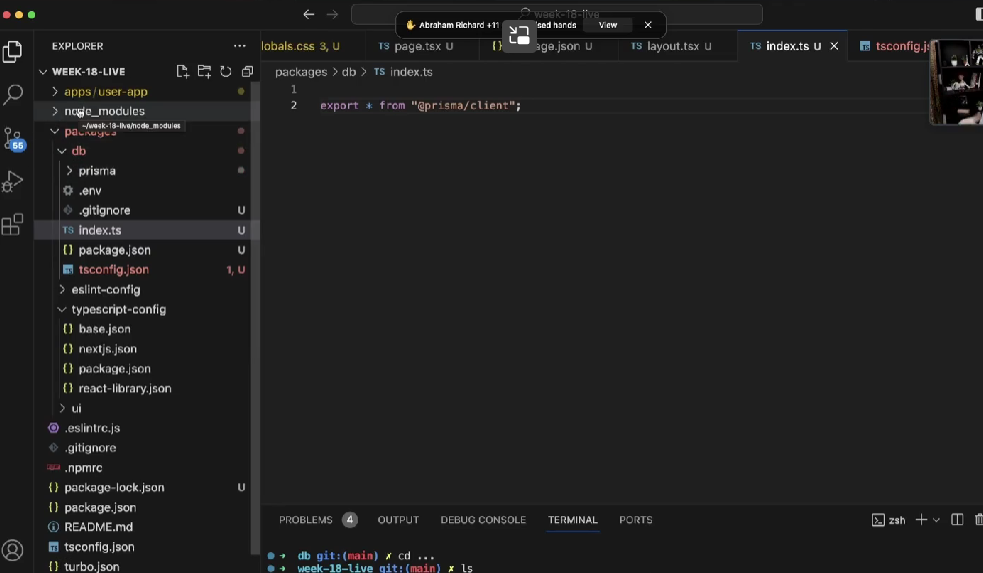

<!-- @format -->

# Turborepo starter

This is an official starter Turborepo.

## Using this example

Run the following command:

```sh
npx create-turbo@latest
```

## What's inside?

This Turborepo includes the following packages/apps:

### Apps and Packages

- `docs`: a [Next.js](https://nextjs.org/) app
- `web`: another [Next.js](https://nextjs.org/) app
- `@repo/ui`: a stub React component library shared by both `web` and `docs` applications
- `@repo/eslint-config`: `eslint` configurations (includes `eslint-config-next` and `eslint-config-prettier`)
- `@repo/typescript-config`: `tsconfig.json`s used throughout the monorepo

Each package/app is 100% [TypeScript](https://www.typescriptlang.org/).

### Utilities

This Turborepo has some additional tools already setup for you:

- [TypeScript](https://www.typescriptlang.org/) for static type checking
- [ESLint](https://eslint.org/) for code linting
- [Prettier](https://prettier.io) for code formatting

### Build

To build all apps and packages, run the following command:

```
cd my-turborepo
pnpm build
```

### Develop

To develop all apps and packages, run the following command:

```
cd my-turborepo
pnpm dev
```

### Remote Caching

Turborepo can use a technique known as [Remote Caching](https://turbo.build/repo/docs/core-concepts/remote-caching) to share cache artifacts across machines, enabling you to share build caches with your team and CI/CD pipelines.

By default, Turborepo will cache locally. To enable Remote Caching you will need an account with Vercel. If you don't have an account you can [create one](https://vercel.com/signup), then enter the following commands:

```
cd my-turborepo
npx turbo login
```

This will authenticate the Turborepo CLI with your [Vercel account](https://vercel.com/docs/concepts/personal-accounts/overview).

Next, you can link your Turborepo to your Remote Cache by running the following command from the root of your Turborepo:

```
npx turbo link
```

## Useful Links

Learn more about the power of Turborepo:

- [Tasks](https://turbo.build/repo/docs/core-concepts/monorepos/running-tasks)
- [Caching](https://turbo.build/repo/docs/core-concepts/caching)
- [Remote Caching](https://turbo.build/repo/docs/core-concepts/remote-caching)
- [Filtering](https://turbo.build/repo/docs/core-concepts/monorepos/filtering)
- [Configuration Options](https://turbo.build/repo/docs/reference/configuration)
- [CLI Usage](https://turbo.build/repo/docs/reference/command-line-reference)

/\*\*\*/

"start"

Notes:- https://projects.100xdevs.com/tracks/Paytm/paytm17-1

1. during architecture part 21:00
   why do we need separate backend for communicating with bank server (cause it needs to be highly available service thus deploying it separately is better).
2. why not do it on frontend (user can spoof it right??)
   what if you transaction got external issue like i made payment and wifi went down money got debited but cant see on frontend(its highly unreliable ) (so let the bank hit out backend and put in database).


another scenario what if you immediately close the frontend page (and then make payment) how would our application know. (so having a separate backend is important)
another scenario why not merge it with the same deployment (reason is we can't aniticipate the traffic like i saw in hotstar video ) cause the backend for updation is crucial part of the application we can't afford to let it have any downtime,

3. another service is when we want to send money from wallet to bank (if bank is down we cant send user message to try again later or we can have another service )
   

4. or another better approach is haveing a queue (store all there and try again latter (auto hits the server after some time )) (that queue task must be performed sequentially cause if another services picos same user then its highly likely we will end up sending multiple request) (thus only sequential order to be followed )
   

content from Cohort 0-1 by 100xdev

bootstrap application

to avoid importing prisma from node modules and to make it cleaner we export it frmo db
so now importing would be db/prisma

<!-- @format -->
